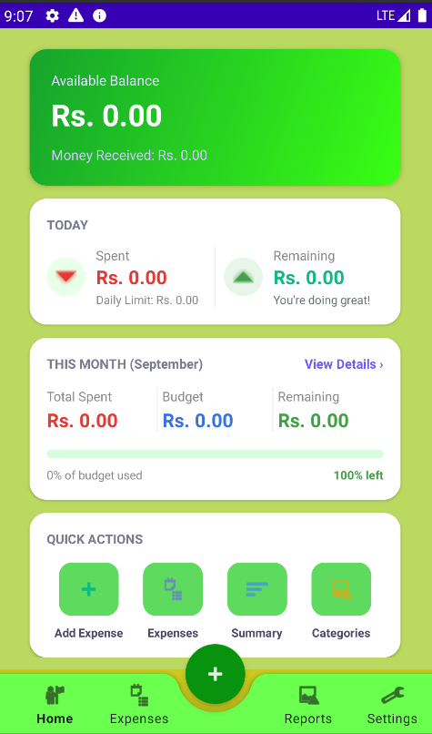
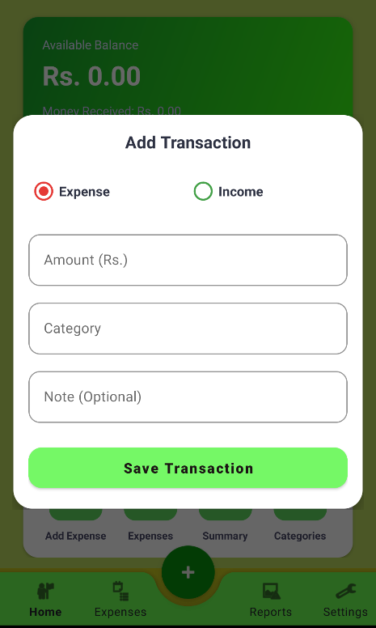
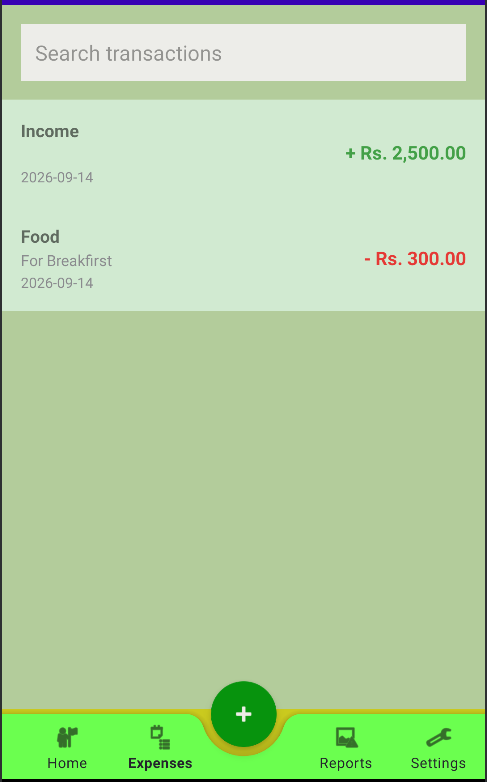
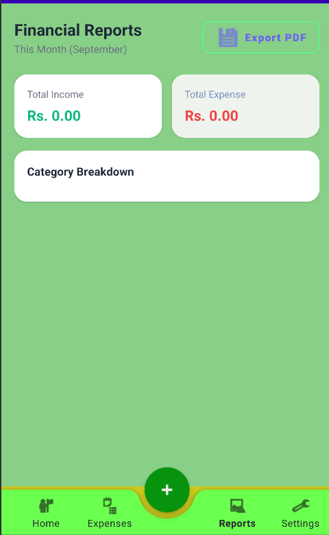
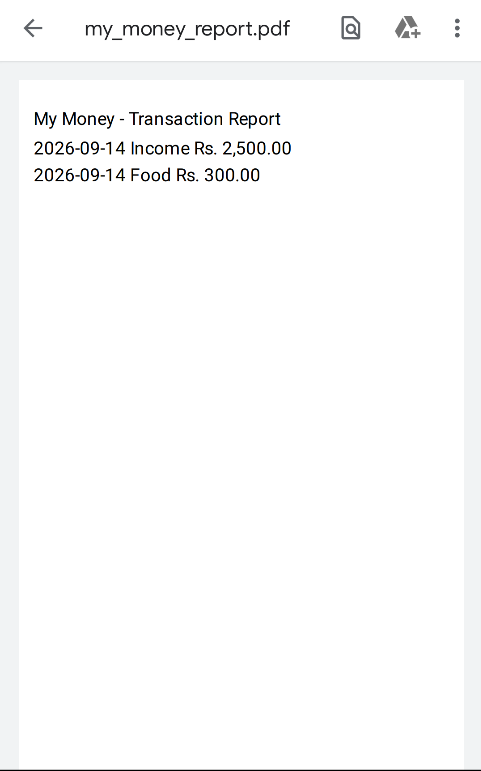
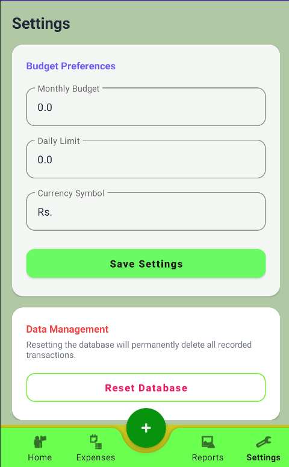

# 💰 My Money - Personal Finance & Budget Tracker

<p align="center">
  
</p>

<p align="center">
  <b>A modern, offline-first Android application to manage your daily income, track expenses, and control your monthly budgets effortlessly.</b>
</p>

---

## 📱 Application features

<p align="center">
  
  
  
</p>

<p align="center">
  
  
  
</p>

---

## ✨ Key Features

- 📊 **Dynamic Dashboard:** Real-time visibility into your available balance, total monthly spent, and today's limit progress.
- 💸 **Expense & Income Tracking:** Quickly log daily transactions with categories and notes.
- 🔔 **Budget Limits & Notifications:** Set daily limits and monthly budget targets with automated alert system when exceeding bounds.
- 🔎 **Transaction History & Search:** Effortlessly filter and search through past financial records.
- 📄 **Export Reports:** Generate and view downloadable PDF financial summaries for your records.
- ⚙️ **Personalized Settings:** Customize currency symbols, update monthly/daily budget caps, or reset data instantly.

---

## 🛠️ Tech Stack & Architecture

- **Language:** Java
- **UI Framework:** Android XML & Material Design Components
- **Architecture:** MVVM / Repository Pattern
- **Local Database:** SQLite
- **Preferences:** Shared Preferences
- **PDF Generation:** Custom PDF Document Service
- **IDE:** Android Studio

---

## 🚀 Getting Started

### Prerequisites
- Android Studio Ladybug (or higher)
- JDK 17
- Android SDK API Level 24+

### Installation
1. Clone the repository:
   ```bash
   git clone [https://github.com/YOUR_USERNAME/My-Money-mobile-App.git](https://github.com/YOUR_USERNAME/My-Money-mobile-App.git)